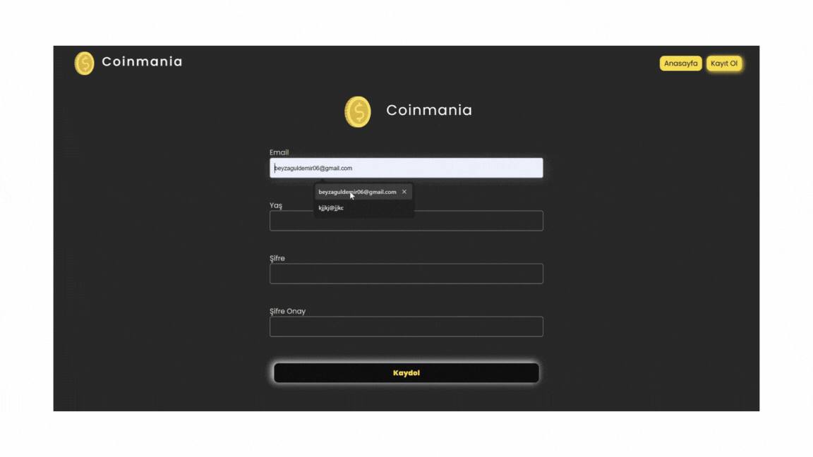

# Coinmania 

# Özellikler

- Kripto paraların temel bilgilerini gösterir ve "Daha Fazla Yükle" özelliği ile ek veri getirir.

- Seçilen kripto paranın detaylı bilgilerini ve fiyat geçmişini grafiklerle gösterir.

- Basit bir kullanıcı kayıt formu ile doğrulama işlemlerini yönetir.

# Kullanılan Teknolojiler

- React: Responsive ve etkileşimli kullanıcı arayüzü için.

- Axios: CoinCap API'den veri çekmek için HTTP istekleri yapar.

- React Router: İstemci tarafı yönlendirme ve gezinmeyi yönetir.

- Chart.js: Tarihsel verileri çizgi grafiklerle görselleştirir.

- Formik: Kullanıcı kayıt sürecinde form durumunu ve doğrulamayı yönetir.

# GIF
 

